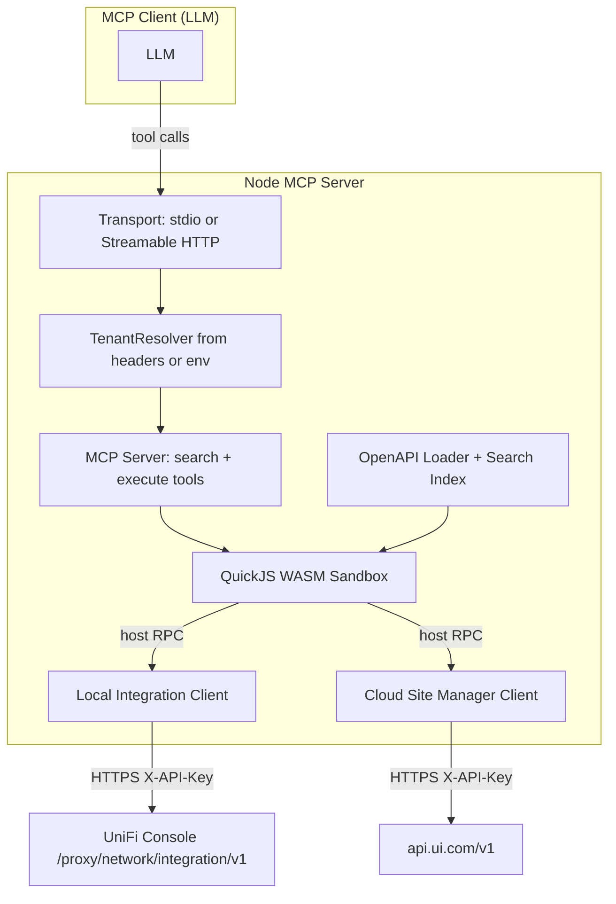

# Architecture



## Request lifecycle (HTTP transport)

1. Client sends an MCP `tools/call` request to `POST /mcp`.
2. The Node HTTP handler reads `X-Unifi-*` headers, runs the request inside an `AsyncLocalStorage` scope, and forwards to the MCP SDK's `StreamableHTTPServerTransport`.
3. The MCP server's `execute` tool handler invokes a per-request `tenantResolver()`. It reads the ALS scope to build a fresh `TenantContext`.
4. A new `ExecuteExecutor` is constructed bound to that context, instantiating per-tenant `HttpClient`s lazily (with the right TLS mode).
5. The QuickJS WASM sandbox is created. A prelude builds the `unifi.local.*` / `unifi.cloud.*` proxy methods from the OpenAPI operation index. The user's code runs inside.
6. When sandbox code calls `unifi.local.sites.listSites({...})`, the prelude calls a host-bound function (`__unifiCallLocal`) which dispatches to the local client. Credentials are read from the `TenantContext` *here*, never from the sandbox.
7. Result is JSON-serialized into the sandbox; user code returns a final value or throws.
8. Host captures the result, formats it as MCP tool content, sends to the client, and disposes the sandbox.

## Sandbox

QuickJS WASM via [`quickjs-emscripten`](https://github.com/justjake/quickjs-emscripten). Limits enforced per-execute:

- Time: 30 s deadline (interrupt handler)
- Memory: 64 MB (`runtime.setMemoryLimit`)
- Stack: 512 KB
- API call budget: 50 calls (configurable)
- Code input: 100 000 chars
- Result: 100 000 chars (truncated with notice)
- Console capture: 1 MB / 1000 entries

Two executors:

- **SearchExecutor** — synchronous QuickJS context. Exposes `spec.local`, `spec.cloud`, `searchOperations(...)`, `getOperation(...)`, `findOperationsByPath(...)`. No network access.
- **ExecuteExecutor** — async QuickJS context (`newAsyncContext()`). Exposes the `unifi` namespace built from the loaded specs. Each operation method is host-asyncified via `newAsyncifiedFunction`.

## Spec ingestion (local)

1. On startup (single-user) or on first request (multi-tenant), the server fetches `GET /proxy/network/integration/v1/info` from the configured controller.
2. Reads `applicationVersion` (e.g. `10.1.84`).
3. Fetches `https://apidoc-cdn.ui.com/network/v<version>/integration.json`.
4. Resolves `$ref`s using `@apidevtools/json-schema-ref-parser`.
5. Builds a flat operation index (`operationId`, `method`, `path`, tags, parameters, request-body flag).
6. Caches in memory (per Node process) + on disk (`src/spec/cache/local-v<version>.json`).

## Spec ingestion (cloud)

The Site Manager OpenAPI URL is checked at runtime. As of writing, Ubiquiti does not publish a machine-readable OpenAPI document at any of the obvious URLs (`apidoc-cdn.ui.com/site-manager/openapi.json`, `api.ui.com/openapi.json`, etc.), so the server ships a curated fallback at `src/spec/cloud-fallback.json` covering documented endpoints (`/v1/hosts`, `/v1/sites`, `/v1/devices`, `/v1/sites/{siteId}/isp-metrics/{type}`, `/v1/sd-wan-configs`). The loader will switch to a live spec automatically the day Ubiquiti publishes one.

## Cloud → Network proxy surface

`api.ui.com` exposes a generic console-passthrough at `/v1/connector/consoles/{consoleId}/*path` that forwards arbitrary requests to applications running on a UniFi console (Network, Protect, ...). The Network Integration API is reachable through it at:

```
https://api.ui.com/v1/connector/consoles/{consoleId}/proxy/network/integration/v1/...
```

`buildUnifiPrelude({ exposeCloudNetworkProxy: true })` emits a `unifi.cloud.network(consoleId)` factory in the sandbox that returns a per-console proxy object identical in shape to `unifi.local.*` but routed via host bindings `__unifiCallCloudNetwork(consoleId, opId, argsJson)` and `__unifiRawCloudNetwork(consoleId, argsJson)`. On the host, `createCloudNetworkProxyClient(creds, consoleId)` builds an `HttpClient` whose `pathPrefix` is the connector path; otherwise it's identical to the regular cloud client (strict TLS, Site Manager API key).

Per-`consoleId` clients are cached for the duration of one `execute` invocation. They never outlive the request — credentials and clients are garbage-collected when the executor disposes.

## Cloudflare Workers entry

A thin alternative deployment (`cf-worker/`) using `@cloudflare/codemode`'s `openApiMcpServer` + `DynamicWorkerExecutor` (Worker Loader-backed isolate). The Worker exposes one namespace at a time and inherits the same per-request header contract. See [cf-worker/README.md](../cf-worker/README.md) for status & limitations.
